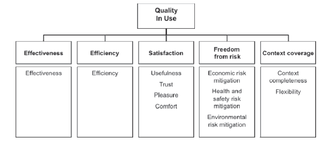

# Fase 1

## 1. Aplicação Escolhida 

O software avaliado neste trabalho é o Krita, um aplicativo livre e de código aberto para pintura digital e ilustração mantido pela comunidade KDE/Krita Foundation. Trata-se de uma aplicação multiplataforma — com pacotes oficiais para Windows, Linux e macOS, além de versão para tablets Android — voltada a artistas, ilustradores e criadores de concept art, quadrinhos, texturas e matte painting. O repositório oficial está hospedado no [Krita](https://github.com/KDE/krita). 

Embora difundido amplamente, o Krita não é um produto comercial proprietário; é distribuído sob licença GPLv3, com desenvolvimento aberto e colaborativo. No enquadramento de aquisição e uso, ele se comporta como um software de prateleira (off-the-shelf) de código aberto, disponibilizado ao público em geral, sem personalizações específicas por cliente. 

O domínio de aplicação do Krita abrange a criação artística digital, educação em artes visuais e fluxos de trabalho de estúdios e profissionais independentes que necessitam de um estúdio de arte 2D completo, com suporte a camadas, pincéis avançados e formatos amplamente utilizados (ex.: PSD). 

## 2. Propósito da avaliação

### 2.1. Requisitante e partes interessadas
<!-- *(comprador, fornecedor, desenvolvedor, operador, etc.)* -->

<!-- Descrever aqui quem está solicitando a avaliação e todas as partes interessadas envolvidas no processo -->

O requisitante principal do Krita é a comunidade de usuários finais, composta por artistas digitais, ilustradores, quadrinistas, animadores e designers que buscam uma solução acessível e completa para criação de artes digitais [^1]. A demanda por melhorias e novas funcionalidades parte majoritariamente desses usuários, por meio de fóruns, enquetes, relatórios de erros e sugestões de recursos.

As partes interessadas envolvidas no processo também incluem [^1] [^2]:

- Os desenvolvedores voluntários e colaboradores, responsáveis pela implementação de recursos, correções de falhas e manutenção do código aberto;

- Mantenedores do projeto, que coordenam a evolução do software, definem prioridades e integram as contribuições enviadas;

- Testadores e demais membros da comunidade que validam versões, reportam problemas e sugerem ajustes;

- Distribuidores e mantenedores de pacotes, como repositórios Linux e lojas de aplicativos, que asseguram que o software esteja acessível e atualizado em diferentes plataformas;

- Apoiadores financeiros, como doadores, patrocinadores e iniciativas de financiamento coletivo;

- Os operadores, em que se destacam-se artistas, estúdios independentes e instituições de ensino, que utilizam o Krita em seus fluxos de trabalho e ajudam na sua difusão.

### 2.2. Propósito da avaliação e uso pretendido dos resultados

Este trabalho, desenvolvido na disciplina de Qualidade de Software, tem como propósito gerar evidências objetivas sobre a qualidade do Krita (projeto KDE) à luz do SQuaRE/ISO/IEC 25010 e transformá-las em decisões práticas para uso e melhoria do produto. Em termos simples: queremos saber o quão bem o Krita atende ao que promete e o quão bem ele se comporta entre plataformas.

**Pergunta central**  
> Em que medida o Krita atende aos requisitos de **Adequação Funcional** e de **Portabilidade** no contexto de tarefas típicas de pintura digital (camadas, pincéis, abertura/salvamento/exportação) em **Windows, Linux, macOS e Android**?

**Objetivos específicos**
1. **Identificar e priorizar** características de qualidade relevantes para o público-alvo.  
2. **Avaliar e medir** as subcaracterísticas selecionadas do ISO/IEC 25010:  
   - **Adequação Funcional**: *completude*, *correção* e *adequação às tarefas*.  
   - **Portabilidade**: *adaptabilidade*, *instalabilidade* e *substituibilidade*.  
3. **Propor recomendações** de melhoria contínua (curto e médio prazo).  
4. **Verificar aderência** a normas e boas práticas, registrando uma **linha de base** para reavaliações futuras.

**Escopo desta Fase 1**  
Foco nas duas características priorizadas (**Funcionalidade/Adequação Funcional** e **Portabilidade**), em **cenários multiplataforma** representativos do uso real do Krita, produzindo insumos claros para as fases seguintes do processo de avaliação.

### 2.3. Escopo, profundidade e objetos de avaliação
*(incluindo relação com avaliações anteriores ou futuras, quando aplicável)*

<!-- Definir o escopo da avaliação, qual será a profundidade da análise e quais objetos serão avaliados -->

### 2.4. ODS relacionados e metas associadas ao software
<!--*(com breve justificativa do vínculo)*-->

<!-- Identificar os Objetivos de Desenvolvimento Sustentável (ODS) relacionados ao software e justificar a conexão -->

  
  
  

  Fonte: Nações Unidas (Brasil) <a href="https://brasil.un.org/pt-br/sdgs" target="_blank">[3]</a>

#### ODS 4 – Educação de Qualidade

O Krita, por ser um software livre e gratuito, democratiza o acesso a ferramentas profissionais de criação digital, permitindo que estudantes, professores e instituições de ensino utilizem recursos avançados sem custos. Isso promove a inclusão educacional, especialmente em áreas como artes digitais, design e animação, favorecendo a aprendizagem criativa e a formação técnica em diferentes contextos.

#### ODS 9 – Indústria, Inovação e Infraestrutura

O desenvolvimento colaborativo e aberto do Krita incentiva a inovação tecnológica e a construção de infraestrutura digital acessível. Sua comunidade global de desenvolvedores e usuários contribui constantemente com melhorias, fortalecendo o ecossistema de software livre e estimulando soluções criativas para diferentes setores, como indústrias criativas, estúdios independentes e startups.

#### ODS 10 – Redução das Desigualdades
Por ser gratuito e de código aberto, o Krita elimina barreiras financeiras que limitam o acesso a softwares profissionais de criação digital. Isso possibilita que artistas de diferentes condições socioeconômicas, regiões e culturas possam desenvolver e compartilhar seu trabalho em igualdade de condições, reduzindo desigualdades no acesso à tecnologia criativa.

---

## 3. Identificação do tipo de produto

### 3.1. Descrição estruturada do software selecionado para avaliação

#### 3.1.1. Descrição geral do produto

- Aplicativo desktop de pintura e ilustração digital 2D, com suporte a animação, camadas, pincéis avançados e gerenciamento de recursos.
- Gratuito e open source (GPL), multiplataforma (Windows, macOS, Linux; também há versão para Android/tablets).
- Foco em artistas: ilustração, concept art, HQs, storyboards, texturas e animação 2D.

#### 3.1.2. Quantidade de funções do produto

Escopo: funções/ações expostas na interface (menus, barras, painéis, diálogos).

Estimativa: centenas de funções (entre 300 e 600 comandos/ações), variando por SO, idioma, presets e plugins. 

Principais agrupamentos:

  - Pintura e ferramentas: motores de pincel, seleção e vetores — entre 20 e 40
  - Exemplos de ferramentas: Pincel à mão livre, Conta‑gotas, Transformar, Preenchimento, Gradiente, Borracha, Linha/Curva, Seleções (retangular, elíptica, laço, varinha mágica), Texto, Ferramentas vetoriais, Assistente de desenho.
  - Cores e gerenciamento de cor: profundidade 8/16/32f, modelos RGB/CMYK, perfis ICC, prova de cor e mistura de cores — dezenas
  - Arquivos e formatos: abrir/salvar KRA, exportar PNG, JPEG, TIFF, PSD e WebP; compressão e metadados/ICC — dezenas
  - Projeção e assistentes: perspectiva, axonométrica, guias e encaixe — diversas
  - Painéis: Camadas e Máscaras, Predefinições de Pincel, Opções da Ferramenta, Linha do tempo — cerca de 20–30
  - Exemplos de painéis: Camadas e Máscaras, Opções da Ferramenta, Predefinições de Pincel, Seletor de Cores Avançado/Paleta, Animação/Linha do tempo, Navegador, Histórico de Desfazer, Gerenciamento de Recursos.
  - Diálogos e preferências/atalhos: dezenas (mais de 100 opções somadas)

#### 3.1.3. Principais tarefas do produto

- Pintura/ilustração digital com múltiplos pincéis, estabilizadores e texturas.
- Gestão de camadas e máscaras, modos de mesclagem e filtros.
- Animação 2D (timeline, onion skin, cache e exportação de vídeos/spritesheets).
- Workflow de cores: escolher modelo de cor (RGB ou CMYK), profundidade de bits (8/16/32f), perfis ICC, mistura de cores, prova de cor e condições de visualização.
- Arquivos: abrir e salvar KRA com camadas e animação; exportar/importar formatos (PNG, JPEG, TIFF, PSD, WebP), escolher compressão e preservar metadados/ICC.
- Projeção/perspectiva: uso de assistentes (pontos de fuga), grades e encaixe para desenho técnico/artístico.
- Criação/gestão de recursos (pincéis, padrões, paletas, templates) e extensões.
- Fluxos profissionais: suporte a tablets/canetas, atalhos e layouts de área de trabalho.

#### 3.1.4. Funções que merecem maior dedicação durante a avaliação

- Sistema de camadas/máscaras e fidelidade de composição (modos de mesclagem, pré‑visualizações, desfazer/refazer).
- Ferramentas de animação (linha do tempo, reprodução, renderização/exportação) quanto à corretude funcional.
- Gerenciamento de recursos (instalação de brush packs, presets, compatibilidade, migração).
- Importação/exportação de arquivos (formatos, metadados, perfis de cor, interoperabilidade).
- Formatos e metadados: compressão, preservação de conteúdo (camadas/alpha/animação), abertura em aplicativos de terceiros, como PSD, e ciclo ida‑e‑volta.
- Assistentes/Projeção: qualidade do encaixe e previsibilidade das guias em cenários complexos.

#### 3.1.5. Quantidade de janelas de interação de dados com o usuário

Principais janelas/diálogos: mais de 20. Exemplos:

  - Tela de Boas‑Vindas, Novo Documento, Abrir/Salvar/Exportar, Preferências, Gerenciador de Recursos, Renderizar Animação/Importar Animação.
  - Editor de Pincéis, Propriedades de Camada, Seletor de Cores/Paletas.
  - Configurações de Tela/Canvas, Assistentes de Desenho, Gerenciador de Perfis de Cor.
  - Timeline/Animação (render/export), Filtros/Efeitos (configuração), Atalhos.

Além disso, há dezenas de painéis interativos (Camadas, Predefinições de Pincel, Opções da Ferramenta, Navegador etc.).

#### 3.1.6. Principais usuários do produto

- Artistas digitais (ilustradores, concept artists, quadrinistas, matte/texture artists).
- Animadores 2D, designers de jogos, estudantes e educadores de artes visuais.

#### 3.1.7. Ambiente em que o produto será inserido

- Estações de trabalho ou notebooks com mouse/teclado; idealmente com mesa digitalizadora/caneta.
- Sistemas operacionais desktop (Windows/macOS/Linux) e tablets Android compatíveis.
- Uso frequentemente offline; integração com fluxos de arte (repositórios de assets).
- Contextos de portabilidade: variação de hardware (GPUs e ambientes gráficos), monitores HiDPI e migração entre sistemas operacionais mantendo arquivos e configurações.

#### 3.1.8. Nível de conhecimento exigido dos usuários em relação à informática

Básico a intermediário: instalação de software, gestão de arquivos/projetos, preferências do sistema, drivers de tablet.

#### 3.1.9. Nível de conhecimento exigido dos usuários em relação ao domínio da aplicação em si

Intermediário a avançado em artes digitais: camadas/máscaras, pincéis e texturas, teoria de cores/ICC, atalhos, e para animação conceitos de frames, timing e export.

#### 3.1.10. Principais componentes do produto que serão submetidos à avaliação

Escopo limitado às características de qualidade SQuaRE: Adequação Funcional e Portabilidade (ISO/IEC 25010).

Adequação Funcional (completude, correção e adequação das funções)

  - Pintura e ferramentas: motores de pincel, estabilização, texturas; ferramentas de seleção e vetoriais.
  - Camadas e máscaras: modos de mesclagem, máscaras de camada/vetor, operações de composição.
  - Animação 2D: linha do tempo, onion skin e exportação em vídeo e spritesheet quanto às funcionalidades prometidas.
  - Gestão de cores: seleção de modelo (RGB ou CMYK), profundidade 8/16/32f, perfis ICC, prova de cor e mistura de cores.
  - Arquivos e formatos: abrir e salvar KRA preservando o conteúdo esperado (camadas e animação), exportar/importar formatos (PNG, JPEG, TIFF, PSD, WebP) e metadados/ICC.
  - Assistentes de projeção/perspectiva: guias, encaixe e pontos de fuga para suportar os fluxos descritos.
  - Recursos e presets: criação, importação e aplicação de pincéis, paletas e templates.

Portabilidade (adaptabilidade, instalabilidade e substituibilidade)

  - Instaladores e execução em múltiplos sistemas operacionais: Windows, macOS e Linux; Android quando aplicável — instalação/desinstalação, dependências e inicialização bem‑sucedidas.
  - Portabilidade de arquivos e projetos: abrir KRA e assets criados em um SO noutro, mantendo funcionalidades e conteúdo.
  - Migração de configurações e recursos: export/import de presets, atalhos e layouts entre plataformas.
  - Substituibilidade: facilidade de desinstalar/atualizar, não deixar resíduos críticos, reassociar tipos de arquivo.

#### 3.1.11. Massa de dados disponível para a avaliação

Existem diversos recursos e materiais públicos úteis:

  - Presets/pincéis e templates distribuídos com o aplicativo.
  - Tutoriais e exemplos na documentação oficial (docs.krita.org) e comunidade (krita-artists.org).
  - Pacotes de brushes/recursos de terceiros compatíveis para testes de importação/uso.
- Pode-se ainda gerar massa sintética (scripts/projetos de exemplo).

#### 3.1.12. Especificação dos requisitos de hardware e software para executar o produto

Software:

  - Windows, macOS ou Linux suportados (consultar página de Download oficial para versões específicas).
  - Dependências embarcadas (instalador oficial); Python opcional para scripting.
  
Hardware (diretrizes gerais):

  - CPU 64-bit; 16 GB de RAM recomendados (4 GB mínimo), SSD recomendado para projetos grandes.
  - GPU : OpenGL 3.0 ou maior / Direct3D 11
  - Mesa digitalizadora/caneta com pressão/tilt para melhor uso (opcional, porém recomendado).
  
Referência para requisitos oficiais e atualizados por plataforma: https://krita.org/en/download

### 3.2. Classificação do tipo de produto

**Nome:** Krita

**Tipo:** Aplicação Desktop Multiplataforma (Qt/C++)

**Repositório:** 
- Principal: https://invent.kde.org/graphics/krita.git (repositório principal KDE)

- Mirror: https://github.com/KDE/krita

**Framework/Backend:**

- **Framework Principal:** Qt Framework (Qt5/Qt6)

- **Linguagem:** C++ (padrão C++17)

- **Sistema de Build:** CMake (versão mínima 3.19.0)

- **Arquitetura:** Plugin-based com bibliotecas modulares

**Plataformas:**

- **Desktop:** Windows, Linux, macOS

- **Mobile:** Android (em desenvolvimento)

- **Distribuição:** AppImage (Linux), instaladores nativos

**Dependências Principais:**

- **Core:** Qt5/6, KDE Frameworks

- **Gráficos:** OpenGL, OpenColorIO (OCIO)

- **Processamento:** Eigen3 (matemática), FFTW3 (transformadas)

- **Formatos:** OpenEXR, LibRaw, OpenJPEG, WebP

- **Python:** PyQt para plugins e scripts

- **Multimídia:** MLT Framework, FFmpeg (para áudio/vídeo)

**Arquitetura Técnica:**

- **SIMD Optimization:** xsimd para processamento vetorial

- **Multi-threading:** Suporte nativo para múltiplos cores

- **Plugin System:** Extensível via plugins C++ e Python

- **Color Management:** Integração com Little CMS e OpenColorIO

- **Brush Engines:** Sistema modular de pincéis personalizáveis

**Características Especiais:**

- **Versão Atual:** 5.3.0-prealpha (branch master)

- **Versão Qt6:** 6.0.0-prealpha (experimental)

- **Licença:** GPL-3.0-only

- **Fundação:** Krita Foundation (organização responsável)

- **Documentação:** https://docs.krita.org/

- **Comunidade:** Krita Artists (https://krita-artists.org/)

---

## 4. Especificação inicial do modelo de qualidade

### Modelo de qualidade com descrição e representação gráfica

**Modelo adotado.** Utilizaremos os dois modelos do **ISO/IEC 25010**:
- **Qualidade em uso ** — resultados da interação do usuário com o sistema: **eficácia**, **eficiência**, **satisfação**, **liberdade de risco** e **cobertura de contexto**.
- **Qualidade de produto** — propriedades do software em oito características: **Adequação Funcional**, **Eficiência de Desempenho**, **Compatibilidade**, **Usabilidade**, **Confiabilidade**, **Segurança**, **Manutenibilidade** e **Portabilidade**; cada uma com subcaracterísticas.

 

<figure style="text-align:center">
  
  <figcaption style="font-size:0.9rem">Qualidade em Uso</figcaption>
</figure>

 

<figure style="text-align:center">
  
  <figcaption style="font-size:0.9rem">Qualidade de Produto</figcaption>
</figure>

### Adaptação do modelo de qualidade
*(refletindo ausência/presença de componentes relevantes ao software avaliado)*

<!-- Explicar como o modelo de qualidade foi adaptado para o software específico sendo avaliado -->

### 3.3. Lista das Características de Qualidade Escolhidas (Método SQUARE)

#### 3.3.1. Adequação Funcional

**Motivação para Escolha:**

A Adequação Funcional foi selecionada para responder diretamente à pergunta central: "Em que medida o Krita atende aos requisitos funcionais em tarefas típicas de pintura digital?". Esta característica permite avaliar:

- **Completude:** Se o Krita oferece todas as funcionalidades necessárias (camadas, pincéis, abertura/salvamento/exportação)

- **Correção:** Se as funcionalidades funcionam conforme especificado

- **Adequação:** Se atende às necessidades do público-alvo (artistas digitais profissionais)

A arquitetura modular do código-fonte (libs/image/, libs/brush/, libs/color/) fornece evidências objetivas para esta avaliação.

#### 3.3.2. Portabilidade

**Motivação para Escolha:**

A Portabilidade foi escolhida para avaliar "o quão bem o Krita se comporta entre plataformas" (Windows, Linux, macOS e Android). As subcaracterísticas avaliadas são:

- **Adaptabilidade:** Funcionamento efetivo em diferentes ambientes

- **Instalabilidade:** Facilidade de instalação em diferentes sistemas

- **Substituibilidade:** Capacidade de substituir outros softwares de pintura digital

#### 3.3.3. Justificativa

Essas características foram priorizadas porque respondem diretamente aos objetivos do trabalho: verificar se o Krita "atende ao que promete" funcionalmente e "se comporta bem entre plataformas", gerando evidências práticas para decisões de uso e melhoria no contexto de pintura digital profissional.

**Critérios de priorização e aplicação:**

- **O propósito e o tipo de produto orientam a seleção das características e o escopo**
- **Relação das características de qualidade priorizadas com o propósito declarado:** Ambas as características escolhidas estão diretamente alinhadas com a pergunta central da avaliação e os objetivos específicos definidos na seção 1.2

## Referências Bibliográficas

[^1]: Krita. Krita Foundation [S.l.]. Disponível em: https://krita.org/pt-pt/about/krita-foundation/
. Acesso em: 25 set. 2025.

[^2]: Krita. Licença de Utilização 4[S.l.]. Disponível em: https://krita.org/pt-pt/about/license
. Acesso em: 25 set. 2025.

[^3]: Nações Unidas Brasil. Objetivos de Desenvolvimento Sustentável. Disponível em: https://brasil.un.org/pt-br/sdgs
. Acesso em: 25 set. 2025.

